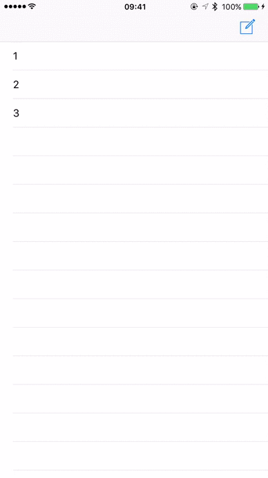

# QIUPresentKit


仿照  iOS 内置的邮件 App 点击新建后弹出一个编辑邮件的 ViewController 的效果




# QIUPresentKit

[](https://travis-ci.org/QiuFeng/SUISeagull)
[](http://cocoapods.org/pods/SUISeagull)
[](http://cocoapods.org/pods/SUISeagull)
[](http://cocoapods.org/pods/SUISeagull)

## Usage
	
	#import "QIUPresentKit.h"

	UIViewController *nextController = [self.storyboard instantiateViewControllerWithIdentifier:@"EditViewController"];
    QIUPresentViewController *controller = [[QIUPresentViewController alloc] initWithViewController:nextController];
    //    nextController.topGuide = 80;
	//    nextController.scale = 0.9;
	//    nextController.duration = 0.1
    [self presentViewController:controller animated:YES completion:nil];
    //   if you want to presentViewController without animated, use below code:
    //   nextController.duration = 0.0
    //   [self presentViewController:controller animated:YES completion:nil];
    
[详情见这里](http://qiufeng.me/ios8uipresentationcontroller)


## Requirements

iOS 8.0

## Installation

SUISeagull is available through [CocoaPods](http://cocoapods.org). To install
it, simply add the following line to your Podfile:

```ruby
pod "QIUPresentKit"
```

## Author

QiuFeng, qfviolethill@163.com

## License

SUISeagull is available under the MIT license. See the LICENSE file for more info.
